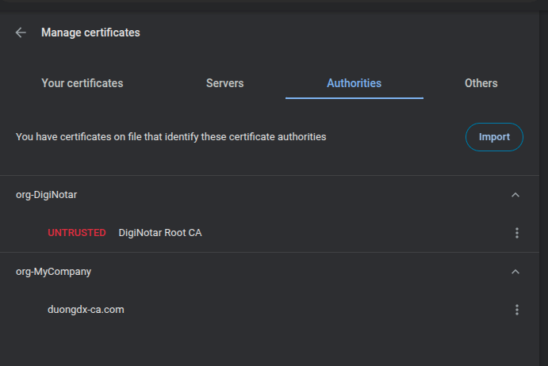

# Generate self-sign-ssl

## I. CA
### 1. Generate rootCA.key:
```bash
openssl genrsa -des3 -passout pass:Abcd123 -out rootCA.key 2048
```

### 2. Generate CA pem from `rootCA.key`:
```bash
country="VN"
state="HN"
locality="HN"
organization="MyCompany"
organizationalunit="MyCompany"
commonname="duongdx-ca.com"
email="duongdx@gmail.com"

openssl req -x509 -new -nodes -key rootCA.key -passin pass:Abcd123 \
-sha256 -days 1825 -out rootCA.pem \
-subj "/C=$country/ST=$state/L=$locality/O=$organization/OU=$organizationalunit/CN=$commonname/emailAddress=$email"
```

### 3. Import CA.pem on browser


## II. Generate SSL for application:

### 1. Create `openssl.conf` file
```
[req]
distinguished_name = req_distinguished_name
req_extensions = v3_req
[req_distinguished_name]
countryName = VN
countryName_default = VN
stateOrProvinceName = HN
stateOrProvinceName_default = HN
localityName = HN
localityName_default = HN
organizationalUnitName = DuonngDX
organizationalUnitName_default = DuonngDX
commonName = duongdx.com
commonName_max = 64
[ v3_req ]
# Extensions to add to a certificate request
basicConstraints = CA:FALSE
keyUsage = nonRepudiation, digitalSignature, keyEncipherment
subjectAltName = @alt_names
[alt_names]
DNS.1 = duongdx.com
DNS.2 = *.duongdx.com
DNS.3 = *.demo.duongdx.com
```

### 2. Generate Application Key:
```bash
openssl genrsa -out duongdx.key 2048
```

### 3. Create `CSR - Certificate Signing Request`
```bash
openssl req -new -out duongdx.csr -key duongdx.key -config openssl.conf
```

### 4. Sign the request:
```bash
openssl x509 -req -days 3650 -in duongdx.csr -CA rootCA.pem -CAkey rootCA.key -CAcreateserial -out duongdx.crt -extensions v3_req -extfile openssl.conf -passin pass:Abcd123
```

### 5. create `duongdx.pem`
```bash
cat duongdx.key |tee duongdx.pem
cat duongdx.csr |tee -a duongdx.pem
cat duongdx.crt |tee -a duongdx.pem
```