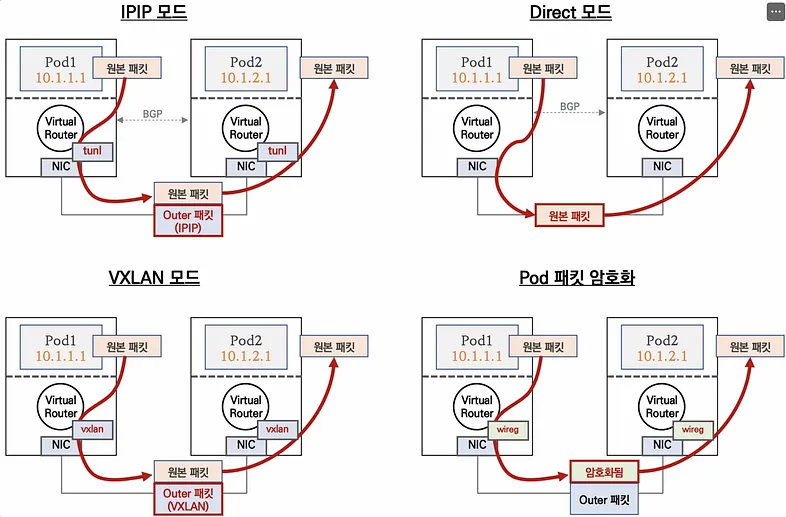

# Calico:

## I. Calico concept:

### 1. Calico key `components`.

**1.1 Bird:**
An open-source BGP routing daemon that distributes routes from Felix to BGP peers (nodes) in the network, facilitating inter-host routing.

**1.2 Felix:**
A daemon that manages routes, ACLs, and other configurations on each host to provide desired connectivity for endpoints.

**1.3 Confd:**
A lightweight, open-source configuration management tool that monitors changes in the Calico Datastore for BGP configurations, AS numbers, logging levels, and IPAM information.

**1.4 IPAM (IP Address Management):**
Controls IP address allocation to Pods within the cluster using Calico’s IP pool resources.

**1.5 Typha:**
Acts as a cache between the datastore and Felix instances to improve scalability by reducing the load on the datastore.

**1.6 Datastore:**
Datastore: Stores Calico-related configurations, similar to Kubernetes’ etcd. It supports both Kubernetes API and etcd storage methods, with the API method being simpler to manage as it doesn’t require an additional datastore.

### 2. Calico networking modes



**2.1 IPIP Mode:**
Similar to Flannel, encapsulating packets for inter-node communication.

**2.2 Direct Mode:**
Packets are routed directly between nodes based on routing information, without encapsulation.

**2.3 VXLAN Mode:**
Inter-node Pod communication occurs through VXLAN interfaces, encapsulating L2 frames in UDP-VXLAN packets.

**2.3 Pod Packet Encryption Mode:**
Utilizes WireGuard tunnels to automatically encrypt and securely transmit Pod traffic between nodes.


## II. Install `calico`:

### 1. install `calico`:

Calico already have installed by Kubespray when we indicated the `kube_network_plugin: calico`

### 2. Post install `calico`


Calico is installed using a custom YAML file.

Calico daemon sets for each node
Custom Resource Definitions (CRDs) for Calico’s components
RBAC rules for Calico’s operation
ConfigMaps for Calico configuration
After installing Calico, several changes occur.


**2.1. New Pods:**
Calico controller pod is deployed
Calico node pods are deployed on each Kubernetes node
CoreDNS pods transition from Pending to Running state

**2.2. Networking interfaces**

New virtual interfaces (like cali* and tunl0) should appear
Routing tables would be updated to include routes for pod networks
IPTables rules would significantly increase to handle pod-to-pod and pod-to-service communication

**2.3. Functionality**

CoreDNS becomes operational, indicating that the cluster’s internal DNS is now functional
Pod-to-pod communication across nodes becomes possible

## III. Hand-ons with Calico:

### 1. install calicoctl and check resource inside `master1`
```bash
# command
curl -L https://github.com/projectcalico/calico/releases/download/v3.28.1/calicoctl-linux-amd64 -o calicoctl

chmod +x calicoctl
sudo mv calicoctl /usr/local/bin/

calicoctl version
Client Version:    v3.28.1
Git commit:        601856343
Cluster Version:   v3.28.1
Cluster Type:      k8s,bgp,kubeadm,kdd

calicoctl ipam show: Displays IPAM information, including used and available IPs.
calicoctl node status: Shows node status and BGP peer information.
calicoctl get ippool: Retrieves IP pool configurations.
calicoctl get workloadEndpoint: Lists all pod network endpoints.
```

### 2. Hand-ons check:

**check cluster config**
```bash
# command
k cluster-info dump | grep -m 2 -E "cluster-cidr|service-cluster-ip-range"
k get cm -n kube-system kubeadm-config -oyaml | grep -i subnet

# result:
"--service-cluster-ip-range=10.233.0.0/18",
"--service-cluster-ip-range=10.233.0.0/18",

podSubnet: 10.233.64.0/18
serviceSubnet: 10.233.0.0/18
```

**1. `Master1`**
```
Pod CIDR: 10.233.104.64/26
ipv4VXLANTunnelAddr: 10.233.104.64/32
NodeIP: 192.168.56.11/32
```

**1.1 Check `master1` eth interface**
```bash
# command:
ip -c addr

# result
3: eth1: <BROADCAST,MULTICAST,UP,LOWER_UP> mtu 1500 qdisc fq_codel state UP group default qlen 1000
    link/ether 08:00:27:c8:72:ad brd ff:ff:ff:ff:ff:ff
    altname enp0s8
    inet 192.168.56.11/24 brd 192.168.56.255 scope global eth1
       valid_lft forever preferred_lft forever
    inet6 fe80::a00:27ff:fec8:72ad/64 scope link 
       valid_lft forever preferred_lft forever
4: vxlan.calico: <BROADCAST,MULTICAST,UP,LOWER_UP> mtu 1450 qdisc noqueue state UNKNOWN group default qlen 1000
    link/ether 66:31:3a:fa:51:89 brd ff:ff:ff:ff:ff:ff
    inet 10.233.104.64/32 scope global vxlan.calico
       valid_lft forever preferred_lft forever
    inet6 fe80::6431:3aff:fefa:5189/64 scope link
       valid_lft forever preferred_lft forever
7: cali3c73a6b29ba@if2: <BROADCAST,MULTICAST,UP,LOWER_UP> mtu 1450 qdisc noqueue state UP group default qlen 1000
    link/ether ee:ee:ee:ee:ee:ee brd ff:ff:ff:ff:ff:ff link-netns cni-de752fd4-4404-bed6-46f6-c6128c16a18b
    inet6 fe80::ecee:eeff:feee:eeee/64 scope link 
       valid_lft forever preferred_lft forever
9: nodelocaldns: <BROADCAST,NOARP> mtu 1500 qdisc noop state DOWN group default 
    link/ether 12:9c:fc:b2:b4:47 brd ff:ff:ff:ff:ff:ff
    inet 169.254.25.10/32 scope global nodelocaldns
       valid_lft forever preferred_lft forever
```

**1.2 Check route on `master1`**
```bash
# command: ip -c route

# result
default via 10.0.2.2 dev eth0 proto dhcp src 10.0.2.15 metric 100
10.233.72.0/26 via 10.233.72.0 dev vxlan.calico onlink
blackhole 10.233.104.64/26 proto 80
10.233.104.65 dev cali3c73a6b29ba scope link 
10.233.105.128/26 via 10.233.105.132 dev vxlan.calico onlink 
10.233.116.0/26 via 10.233.116.0 dev vxlan.calico onlink 
10.233.125.0/26 via 10.233.125.0 dev vxlan.calico onlink 
192.168.56.0/24 dev eth1 proto kernel scope link src 192.168.56.11
```

**1.3 check `master1` with calico**
```bash
# check with calico
calicoctl get node master1 -o yaml

# result
apiVersion: projectcalico.org/v3
kind: Node
metadata:
  annotations:
    projectcalico.org/kube-labels: '{"beta.kubernetes.io/arch":"amd64","beta.kubernetes.io/os":"linux","kubernetes.io/arch":"amd64","kubernetes.io/hostname":"master1","kubernetes.io/os":"linux","node-role.kubernetes.io/control-plane":"","node.kubernetes.io/exclude-from-external-load-balancers":""}'
  creationTimestamp: "2025-03-11T17:26:46Z"
  labels:
    beta.kubernetes.io/arch: amd64
    beta.kubernetes.io/os: linux
    kubernetes.io/arch: amd64
    kubernetes.io/hostname: master1
    kubernetes.io/os: linux
    node-role.kubernetes.io/control-plane: ""
    node.kubernetes.io/exclude-from-external-load-balancers: ""
  name: master1
  resourceVersion: "53359"
  uid: 2871c29f-f587-486f-9319-d7e121774b11
spec:
  addresses:
  - address: 192.168.56.11/24
    type: CalicoNodeIP
  - address: 192.168.56.11
    type: InternalIP
  bgp:
    ipv4Address: 192.168.56.11/24
  ipv4VXLANTunnelAddr: 10.233.104.64
  orchRefs:
  - nodeName: master1
    orchestrator: k8s
status: {}
```

**2. `Master2`**
```
Pod CIDR: 10.233.116.0/26
ipv4VXLANTunnelAddr: 10.233.116.0/32
NodeIP: 192.168.56.11/32
```

**2.1 Check `master2` eth interface**
```bash
# command
ip -c addr

# result 
3: eth1: <BROADCAST,MULTICAST,UP,LOWER_UP> mtu 1500 qdisc fq_codel state UP group default qlen 1000
    link/ether 08:00:27:a7:73:ce brd ff:ff:ff:ff:ff:ff
    altname enp0s8
    inet 192.168.56.12/24 brd 192.168.56.255 scope global eth1
       valid_lft forever preferred_lft forever
    inet6 fe80::a00:27ff:fea7:73ce/64 scope link 
       valid_lft forever preferred_lft forever
4: vxlan.calico: <BROADCAST,MULTICAST,UP,LOWER_UP> mtu 1450 qdisc noqueue state UNKNOWN group default qlen 1000
    link/ether 66:35:31:bd:3e:3a brd ff:ff:ff:ff:ff:ff
    inet 10.233.116.0/32 scope global vxlan.calico
       valid_lft forever preferred_lft forever
    inet6 fe80::6435:31ff:febd:3e3a/64 scope link 
       valid_lft forever preferred_lft forever
7: calif3d1a45b809@if2: <BROADCAST,MULTICAST,UP,LOWER_UP> mtu 1450 qdisc noqueue state UP group default qlen 1000
    link/ether ee:ee:ee:ee:ee:ee brd ff:ff:ff:ff:ff:ff link-netns cni-a3a09e02-ea7c-a0ec-380f-e5e1dd753848
    inet6 fe80::ecee:eeff:feee:eeee/64 scope link 
       valid_lft forever preferred_lft forever
9: nodelocaldns: <BROADCAST,NOARP> mtu 1500 qdisc noop state DOWN group default 
    link/ether ea:6f:a9:35:ce:64 brd ff:ff:ff:ff:ff:ff
    inet 169.254.25.10/32 scope global nodelocaldns
       valid_lft forever preferred_lft forever
```

**2.2 Check route on `master2`**
```bash
default via 10.0.2.2 dev eth0 proto dhcp src 10.0.2.15 metric 100
10.0.2.0/24 dev eth0 proto kernel scope link src 10.0.2.15 metric 100 
10.0.2.2 dev eth0 proto dhcp scope link src 10.0.2.15 metric 100 
10.0.2.3 dev eth0 proto dhcp scope link src 10.0.2.15 metric 100 
10.233.72.0/26 via 10.233.72.0 dev vxlan.calico onlink 
10.233.104.64/26 via 10.233.104.64 dev vxlan.calico onlink 
10.233.105.128/26 via 10.233.105.132 dev vxlan.calico onlink 
blackhole 10.233.116.0/26 proto 80
10.233.116.1 dev calif3d1a45b809 scope link 
10.233.125.0/26 via 10.233.125.0 dev vxlan.calico onlink 
192.168.56.0/24 dev eth1 proto kernel scope link src 192.168.56.12
```
**2.3 check `master2` with `calicoctl`**
```bash
# command:
calicoctl get node master2 -o yaml

# result:
apiVersion: projectcalico.org/v3
kind: Node
metadata:
  annotations:
    projectcalico.org/kube-labels: '{"beta.kubernetes.io/arch":"amd64","beta.kubernetes.io/os":"linux","kubernetes.io/arch":"amd64","kubernetes.io/hostname":"master2","kubernetes.io/os":"linux","node-role.kubernetes.io/control-plane":"","node.kubernetes.io/exclude-from-external-load-balancers":""}'
  creationTimestamp: "2025-03-11T17:27:49Z"
  labels:
    beta.kubernetes.io/arch: amd64
    beta.kubernetes.io/os: linux
    kubernetes.io/arch: amd64
    kubernetes.io/hostname: master2
    kubernetes.io/os: linux
    node-role.kubernetes.io/control-plane: ""
    node.kubernetes.io/exclude-from-external-load-balancers: ""
  name: master2
  resourceVersion: "60970"
  uid: 67f86287-5046-4813-9160-ce813eee3391
spec:
  addresses:
  - address: 192.168.56.12/24
    type: CalicoNodeIP
  - address: 192.168.56.12
    type: InternalIP
  bgp:
    ipv4Address: 192.168.56.12/24
  ipv4VXLANTunnelAddr: 10.233.116.0
  orchRefs:
  - nodeName: master2
    orchestrator: k8s
status: {}
```


### 3. 💡 Conclusion `Calico VXLAN` routing:

When using **Calico with VXLAN** encapsulation:

- Each **Kubernetes node** is assigned a unique **Pod CIDR** (e.g., a `/26` subnet).
- Each node has a **VXLAN Tunnel IP address** (usually within its Pod CIDR).
- Calico sets up **Linux routes** on each node to reach other nodes’ Pod CIDRs via their VXLAN IPs.
- These routes go through the **`vxlan.calico`** interface using **VXLAN encapsulation**.
- The `onlink` flag tells the kernel to send traffic directly to the specified next-hop IP **without ARP resolution** (VXLAN handles that).

---

**📘 Example Route Explanation**
```bash
# command
10.233.105.128/26 via 10.233.105.132 dev vxlan.calico onlink
```

| Component                   | Meaning                                                                 |
|----------------------------|-------------------------------------------------------------------------|
| `10.233.105.128/26`        | Pod CIDR assigned to another node (e.g., `worker1`)                     |
| `via 10.233.105.132`       | VXLAN Tunnel IP of `worker1`                                            |
| `dev vxlan.calico`         | Interface used for VXLAN encapsulated traffic                           |
| `onlink`                   | Tells kernel to send directly via that IP (VXLAN handles encapsulation) |

🔎 **Interpretation:**  
“Send traffic destined to `10.233.105.128/26` via `10.233.105.132` through `vxlan.calico`.”

---

🔍 **Breakdown of Your Routes**

| Route Entry                                              | Pod CIDR             | VXLAN Tunnel IP       | Node (Example) |
|----------------------------------------------------------|----------------------|------------------------|----------------|
| `10.233.72.0/26 via 10.233.72.0 dev vxlan.calico onlink` | `10.233.72.0/26`     | `10.233.72.0`          | Node A         |
| `blackhole 10.233.104.64/26 proto 80`                    | `10.233.104.64/26`   | Local Pod CIDR (self)  | Local node     |
| `10.233.104.65 dev cali3c73a6b29ba scope link`           | Single pod IP        | One of the local pods  | Local node     |
| `10.233.105.128/26 via 10.233.105.132 ...`               | `10.233.105.128/26`  | `10.233.105.132`       | worker1        |
| `10.233.116.0/26 via 10.233.116.0 ...`                   | `10.233.116.0/26`    | `10.233.116.0`         | node X         |
| `10.233.125.0/26 via 10.233.125.0 ...`                   | `10.233.125.0/26`    | `10.233.125.0`         | node Y         |

---

🧠 **How to find VXLAN IPs for each node?**

Run this:

```bash
# command
kubectl get nodes -o wide
```

Then on each node, check:

```bash
# command
ip -4 addr show vxlan.calico
```

That will give you the **VXLAN Tunnel IP** of the node.

---

✅ **Summary**
| Term                     | Meaning                                                                |
|--------------------------|------------------------------------------------------------------------|
| `Pod CIDR`               | A subnet assigned to each node for its pods                           |
| `VXLAN Tunnel IP`        | An IP used by Calico to route VXLAN encapsulated packets              |
| `vxlan.calico` interface | The virtual network interface Calico uses for VXLAN overlay traffic   |
| `onlink`                 | Bypasses kernel ARP – lets Calico directly encapsulate and route      |
| `blackhole`              | A kernel route that prevents routing to a certain CIDR (used locally) |

---


Sure! Here's the English version of your conclusion:

---

### 🧾 **Conclusion: What’s Happening**
| Component                 | Explanation                                                                 |
|--------------------------|-----------------------------------------------------------------------------|
| Pod → Pod (same node)    | Traffic goes directly through the `cali*` interface                         |
| Pod → Pod (different node) | VXLAN encapsulated traffic is sent through `vxlan.calico` to the destination node's VXLAN IP |
| Service IP (ClusterIP)   | Handled internally by kube-proxy (using iptables or IPVS)                   |
| `blackhole` routes       | Prevent routing loops back to the current node's own Pod CIDR               |


### 4. check `calico networking mode`:
```bash
# command
calicoctl get ippool -o wide

# result
NAME           CIDR             NAT    IPIPMODE   VXLANMODE   DISABLED   DISABLEBGPEXPORT   SELECTOR   
default-pool   10.233.64.0/18   true   Never      Always      false      false              all() 
```

#### 4.1 Calico with `VXLANMODE mode`

`VXLANMODE: Always` indicated the `Calico mode` is VXLANMODE

```bash
# command:
route -n | egrep '(Destination|UG)'

# result
Destination     Gateway         Genmask         Flags Metric Ref    Use Iface
0.0.0.0         10.0.2.2        0.0.0.0         UG    100    0        0 eth0
10.233.72.0     10.233.72.0     255.255.255.192 UG    0      0        0 vxlan.calico
10.233.105.128  10.233.105.132  255.255.255.192 UG    0      0        0 vxlan.calico
10.233.116.0    10.233.116.0    255.255.255.192 UG    0      0        0 vxlan.calico
10.233.125.0    10.233.125.0    255.255.255.192 UG    0      0        0 vxlan.calico
```

#### 4.2 Calico with `IpIp mode`

`IPIPMODE: Always` indicated the `Calico mode` is IPIPMODE

```bash
# command
route -n | egrep '(Destination|UG)'

# result
Destination     Gateway         Genmask         Flags Metric Ref    Use Iface
0.0.0.0         192.168.10.1    0.0.0.0         UG    100    0        0 ens5
172.16.34.0     192.168.20.100  255.255.255.0   UG    0      0        0 tunl0
172.16.116.0    192.168.10.10   255.255.255.0   UG    0      0        0 tunl0
172.16.184.0    192.168.10.102  255.255.255.0   UG    0      0        0 tunl0
192.168.0.2     192.168.10.1    255.255.255.255 UGH   100    0        0 ens5
```

#### 4.3 Calico with `Direct Routing Mode`
```bash
# command
calicoctl get ippool default-ipv4-ippool -o yaml | sed -e "s/ipipMode: Always/ipipMode: Never/" | calicoctl apply -f -

# result
Successfully applied 1 'IPPool' resource(s)

# To switch to Direct mode, we need to change IPIPMODE to Never:

ubuntu@master1:~# calicoctl get ippool -o wide
NAME                  CIDR            NAT    IPIPMODE   VXLANMODE   DISABLED   DISABLEBGPEXPORT   SELECTOR
default-ipv4-ippool   172.16.0.0/16   true   Never      Never       false      false              all()
```

The Iface column now shows `ens5`, indicating that traffic to pod networks is routed via the `physical interface`.

```bash
# command
route -n | egrep '(Destination|UG)'

# result
ubuntu@k8s-w1:~$ route -n | egrep '(Destination|UG)'
Destination     Gateway         Genmask         Flags Metric Ref    Use Iface
0.0.0.0         192.168.10.1    0.0.0.0         UG    100    0        0 ens5
172.16.34.0     192.168.10.1    255.255.255.0   UG    0      0        0 ens5
172.16.116.0    192.168.10.10   255.255.255.0   UG    0      0        0 ens5
172.16.184.0    192.168.10.102  255.255.255.0   UG    0      0        0 ens5
192.168.0.2     192.168.10.1    255.255.255.255 UGH   100    0        0 ens5
```
