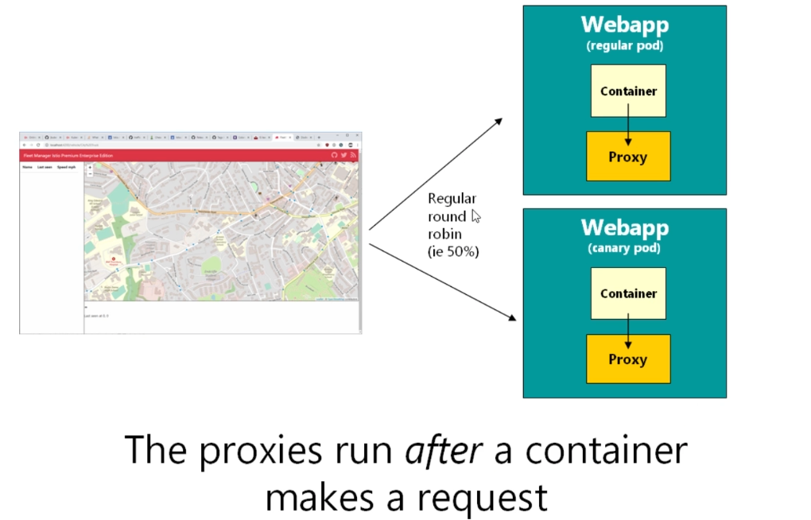
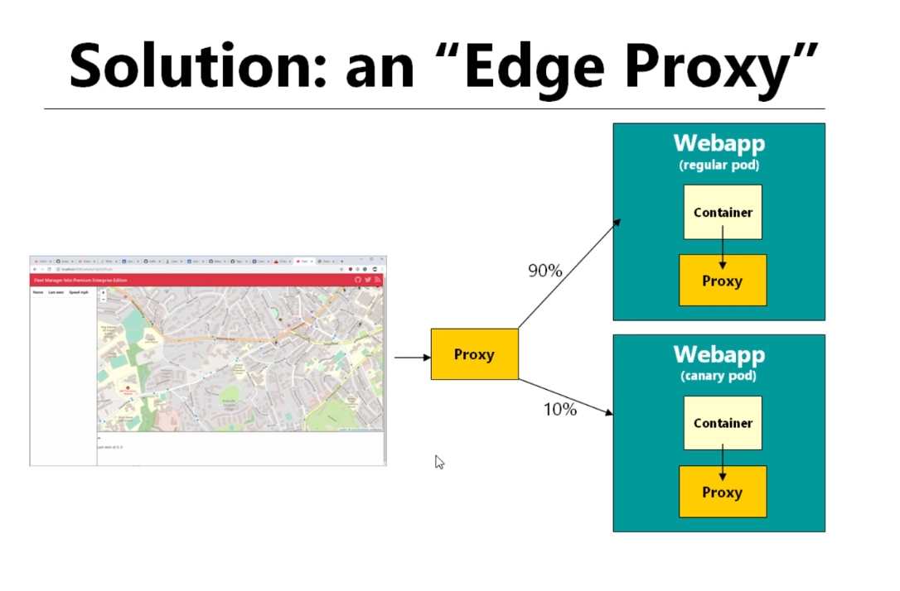
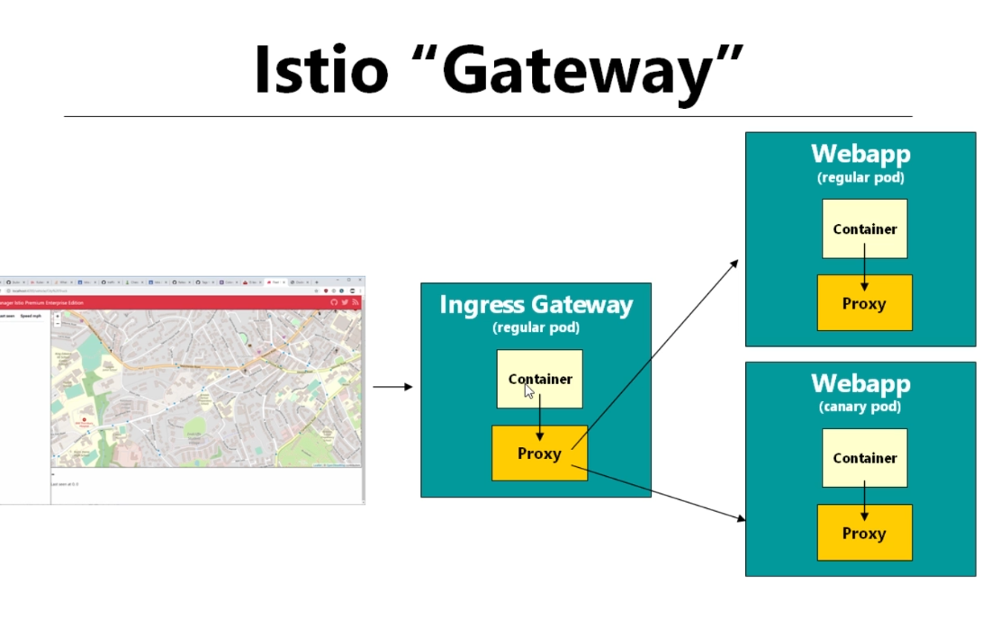

# Istio Gateway

## I. Pre-requisite:

### 1. create deployment `deployment/webapp-original` and `deployment/webapp-experimental`:
```yaml
# original config
image: richardchesterwood/istio-fleetman-webapp-angular:6

# original experimental
image: richardchesterwood/istio-fleetman-webapp-angular:6-experimental
```


### 2. create canary with following rule: `90% to original`, `10% to experimental`

**config `DestinationRule`**
```yaml
kind: DestinationRule
apiVersion: networking.istio.io/v1
metadata:
  name: fleetman-webapp
spec:
  host: fleetman-webapp
  subsets:
  - name: original-subset
    labels:
      version: original
  - name: experimental-subset
    labels:
      version: experimental
```

**config `VirtualService`**
```yaml
kind: VirtualService
apiVersion: networking.istio.io/v1
metadata:
  name: fleetman-webapp
spec:
  hosts:
  - fleetman-webapp
  http:
  - route:
    - destination:
        host: fleetman-webapp
        subset: original-subset # <--- directo DestinationRule  
      weight: 90
    - destination:
        host: fleetman-webapp
        subset: experimental-subset # <--- directo DestinationRule  
      weight: 10
```

### 3. Verify configuration:

**3.1 Try connect from a `POD`**

- Trying curl to `fleetman-webapp.default.svc.cluster.local` from inside `k8s-pod`. 

- We can see only some request approached to `experimental version`. almost request be distributed to `original version`

- *The reason is request made by the pod and then it will be redicted to envoy proxy (sidecar)*

```bash
# Command
while true;
do
    curl -s http://fleetman-webapp.default.svc.cluster.local/ | grep -i title;
    sleep 1;
done;

# The result:
  <title>Fleet Management Istio Premium Enterprise Edition</title>
  <title>Fleet Management</title>
  <title>Fleet Management</title>
  <title>Fleet Management</title>
  <title>Fleet Management</title>
  <title>Fleet Management</title>
  <title>Fleet Management Istio Premium Enterprise Edition</title>
  <title>Fleet Management</title>
  <title>Fleet Management</title>
  <title>Fleet Management</title>
  <title>Fleet Management</title>
  <title>Fleet Management</title>
  <title>Fleet Management</title>
  <title>Fleet Management</title>
  <title>Fleet Management</title>
  <title>Fleet Management</title>
  <title>Fleet Management</title>
  <title>Fleet Management</title>
  <title>Fleet Management</title>
  <title>Fleet Management Istio Premium Enterprise Edition</title>
  <title>Fleet Management</title>
  <title>Fleet Management</title>
  <title>Fleet Management Istio Premium Enterprise Edition</title>
  <title>Fleet Management</title>
  <title>Fleet Management</title>
  <title>Fleet Management</title>
  <title>Fleet Management</title>
  <title>Fleet Management</title>
  <title>Fleet Management Istio Premium Enterprise Edition</title>

```

**3.2 Try connect from a `Browser` or `Client machine`**

- The config `Splitting Traffic` doesn't work. It still response `50%-50%` mechanism

- *The reason is request from user machine it haven't through any envoy proxy*



```bash
# command
while true;
do
    curl -s http://10.0.12.6:30080/ | grep -i title;
    sleep 1;
done;

# Result
  <title>Fleet Management</title>
  <title>Fleet Management</title>
  <title>Fleet Management Istio Premium Enterprise Edition</title>
  <title>Fleet Management</title>
  <title>Fleet Management Istio Premium Enterprise Edition</title>
  <title>Fleet Management Istio Premium Enterprise Edition</title>
  <title>Fleet Management</title>
  <title>Fleet Management</title>
  <title>Fleet Management</title>
  <title>Fleet Management</title>
  <title>Fleet Management Istio Premium Enterprise Edition</title>
  <title>Fleet Management</title>
  <title>Fleet Management</title>
```

**3.3 Solution: `Edge Proxy`**






## II. Istio-Gateways:

### 1. example config:

**1.1 create the gateway**
```yaml
apiVersion: networking.istio.io/v1
kind: Gateway
metadata:
  name: fleet-webapp-gateway
spec:
  selector:
    istio: ingress # <--  k get pod -n istio-system --show-labels (get label of istio-gateway)
  servers:
  - port:
      number: 80
      name: http
      protocol: HTTP
    hosts:
    - "*" # <--- Matching with VirtualService host
```

**1.2 update the `VirtualService`**
```yaml
kind: VirtualService
apiVersion: networking.istio.io/v1
metadata:
  name: fleetman-webapp
spec:
  hosts:
  - "*"  # <--- Matching with istio-gateway host
  gateways:
  - fleet-webapp-gateway
  http:
  - route:
    - destination:
        host: fleetman-webapp
        subset: original-subset # <--- direct to DestinationRule  
      weight: 90
    - destination:
        host: fleetman-webapp
        subset: experimental-subset # <--- direct to DestinationRule  
      weight: 10
```

### 2. Base Path Routing

**2.1 create the gateway**
```yaml
apiVersion: networking.istio.io/v1
kind: Gateway
metadata:
  name: fleet-webapp-gateway
spec:
  selector:
    istio: ingress # <--  k get pod -n istio-system --show-labels (get label of istio-gateway)
  servers:
  - port:
      number: 80
      name: http
      protocol: HTTP
    hosts:
    - "*" # <--- Matching with VirtualService host
```

**2.2 update the `VirtualService`**
```yaml
apiVersion: networking.istio.io/v1
kind: VirtualService
metadata:
  name: fleetman-webapp
spec:
  hosts:
  - "*"  # <--- Matching with istio-gateway host
  gateways:
  - fleet-webapp-gateway
  http:
  - match: 
    - uri: # IF
        prefix: "/prefix1"
    - uri: # OR
        prefix: "/prefix2"
    - uri: # OR
        prefix: "/prefix3"
    route: # Then
    - destination:
        host: fleetman-webapp
        subset: experimental-subset # <--- direct to DestinationRule  
  
  - match:
    - uri: # IF
        prefix: "/" 
    route:
    - destination:
        host: fleetman-webapp
        subset: original-subset # <--- direct to DestinationRule 
```

**2.3 Verify the config**
```bash
# check prefix `/`
$ while true;
do
    curl -s http://10.0.12.6:30880/test | grep -i title;
    sleep 1;
done;
  <title>Fleet Management</title>
  <title>Fleet Management</title>
  <title>Fleet Management</title>
  <title>Fleet Management</title>
  <title>Fleet Management</title>

# check `/prefix1`
$ while true;
do
    curl -s http://10.0.12.6:30880/prefix1 | grep -i title;
    sleep 1;
done;
  <title>Fleet Management Istio Premium Enterprise Edition</title>
  <title>Fleet Management Istio Premium Enterprise Edition</title>
  <title>Fleet Management Istio Premium Enterprise Edition</title>
  <title>Fleet Management Istio Premium Enterprise Edition</title>
  <title>Fleet Management Istio Premium Enterprise Edition</title>
  <title>Fleet Management Istio Premium Enterprise Edition</title>
  <title>Fleet Management Istio Premium Enterprise Edition</title>
  <title>Fleet Management Istio Premium Enterprise Edition</title>
```